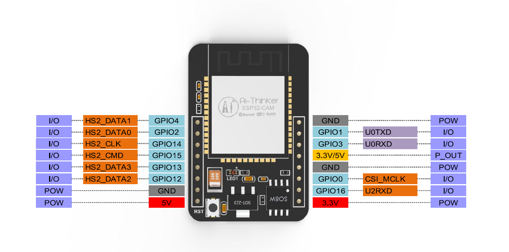
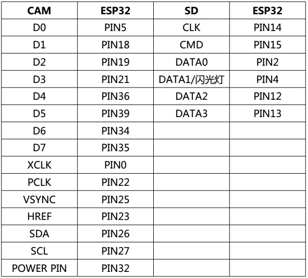

# ESP32-CAM摄像头开发板

## 概述

**全系列模组购买请戳：**[安信可官方淘宝店](http://shop.ai-thinker.com/)

------

------

##### ESP32-CAM是安信可最新发布小尺寸的摄像头模组。该模块可以作为最小系统独立工作，尺寸仅为27*40.5*4.5mm，深度睡眠电流最低达到6mA。

##### ESP32-CAM可广泛应用于各种物联网场合，适用于家庭智能设备、工业无线控制、无线监控、QR无线识别，无线定位系统信号以及其它物联网应用，是物联网应用的理想解决方案。

##### ESP32-CAM采用DIP封装，直接插上底板即可使用，实现产品的快速生产，为客户提供高可靠性的连接方式，方便应用于各种物联网硬件终端场合。

体积超小的802.11b/g/n Wi-Fi + BT/BLE SoC模块

## 产品特性

------

采用低功耗双核32位CPU，可作应用处理器

主频高达240MHz，运算能力高达 600 DMIPS

内置 520 KB SRAM，外置8MB PSRAM

支持UART/SPI/I2C/PWM/ADC/DAC等接口

支持OV2640和OV7670摄像头，内置闪光灯

支持图片WiFI上传

支持TF卡

支持多种休眠模式。

内嵌Lwip和FreeRTOS

支持 STA/AP/STA+AP 工作模式

支持 Smart Config/AirKiss 一键配网

支持二次开发

## 应用场景

------

家庭智能设备图传

无线监控

智慧农业

QR无线识别

## 管脚定义

------

## 注意

------

1.请保证模块输入电源至少5V 2A,否则图片会有几率出现水纹。

2.ESP32 GPIO32管脚控制摄像头电源，当摄像头工作时，请把GPIO32拉低。

3.由于IO0连接摄像头XCLK,使用时请把IO0悬空，请勿接高低电平。

4.**出厂已含有默认固件，不另外提供下载，如需重烧其他固件请谨慎操作。**

## 摄像头驱动代码

------

[摄像头使用说明](https://docs.ai-thinker.com/_media/esp32_camera固件更新说明.pdf)

## 文档

------

规格书：[ ESP32-CAM 规格书](https://docs.ai-thinker.com/_media/esp32/docs/esp32-cam_product_specification_zh.pdf)

原理图：[ ESP32-CAM 原理图](https://docs.ai-thinker.com/_media/esp32/docs/esp32_cam_sch.pdf)

摄像头规格书(英文版)：[ov2640_ds_1.8_.pdf](https://docs.ai-thinker.com/_media/esp32/docs/ov2640_ds_1.8_.pdf)

使用教程：https://aithinker.blog.csdn.net/article/details/108000974